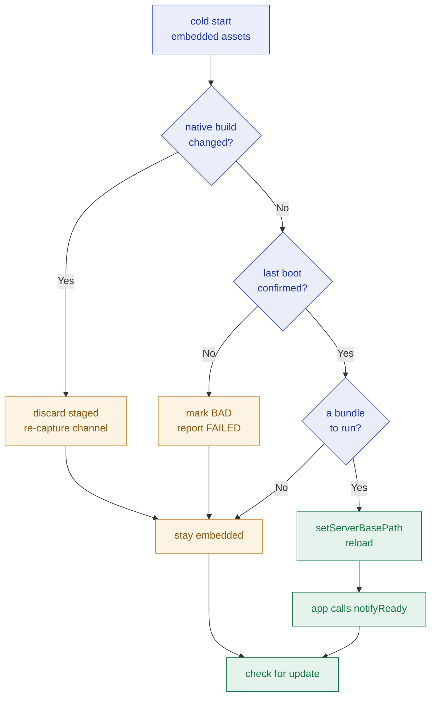
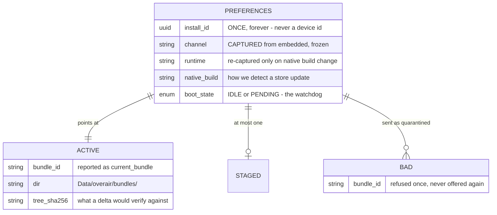

# The client SDK

> **A Capacitor app installs one npm package and starts receiving updates.** The SDK
> is pure TypeScript — no Swift, no Kotlin, no `cap sync` — because everything it
> needs is already native inside Capacitor. The one thing that is not, unzipping, is
> fast enough in JavaScript: **382 ms** for a real 292-file, 7.26 MB bundle.

Design document. Written before the code, at gate 2. Nothing here is built yet.

---

## 1 · Why pure TypeScript, measured rather than assumed

The whole native surface an OTA updater needs already ships inside Capacitor:

| The SDK must | Provided by | Where |
|---|---|---|
| Download a bundle | `Filesystem.downloadFile` — native, straight to disk | `@capacitor/filesystem` `definitions.d.ts:626` |
| Point the webview at it | `WebView.setServerBasePath` — a **core** plugin | `@capacitor/core` `core-plugins.d.ts:6` |
| Read the current root | `WebView.getServerBasePath` | same, line 7 |
| Verify `sha256` | WebCrypto `crypto.subtle.digest` | webview builtin |
| Persist state | `@capacitor/preferences` | — |
| `app_version`, `build_number` | `@capacitor/app` `getInfo()` | — |
| **Unzip** | **nothing** | the only gap |

Native implementations of the WebView methods live in Capacitor itself
(`@capacitor/android` `WebView.java`, `@capacitor/ios` `CapacitorBridge.swift`), so a
consumer needs no plugin of ours on either platform.

**The spike.** The gap is one function, so the only question was whether JavaScript
can close it. Measured on an iPhone 16 Pro simulator against a real Capacitor web
build from a shipping production app (292 files, 7.26 MB raw, 2.20 MB zipped):

| Phase | Time |
|---|---:|
| fetch the archive | 4 ms |
| `sha256` verify | 3 ms |
| unzip (`fflate`) | 102 ms |
| base64-encode 292 entries | 43 ms |
| `Filesystem.writeFile` x292 | 237 ms — **0.81 ms/file** |
| **archive to disk** | **382 ms** |

> [!NOTE]
> **Measured on an Apple Silicon simulator, which is optimistic.** A low-end Android
> will be some multiple of this. The decision does not turn on the multiple: at 10x
> this is under 4 seconds, for work that happens off the critical path on launch or
> resume. Android corroboration is an open point, not a blocker.

**The losing option: a native Capacitor plugin** (what `@capgo/capacitor-updater` and
Ionic Live Updates both do). It would make unzip and the directory swap faster than
they need to be, and it costs every consumer a `cap sync` and a native rebuild, pins
them to a Capacitor major, and means **a bug in the updater can only be fixed by a
store release** — a strange property for the thing whose job is to avoid store
releases. A pure-TS SDK ships inside the web bundle and can update itself.

---

## 2 · The boot decision  *(the decision table)*

`native` = `App.getInfo().build` · `stored` = the native build recorded when the current
bundle was staged · `confirmed` = the last boot into that bundle called `notifyReady()`

| # | `stored == native` | on disk | confirmed | -> boots from | -> and then |
|:-:|---|---|---|---|---|
| 1 | n/a | nothing | n/a | embedded | check for an update |
| 2 | **no** | anything | n/a | embedded | **discard every staged bundle**, re-capture channel + runtime, check |
| 3 | yes | staged, verified | first boot | **the staged bundle** | mark PENDING, arm the next-launch watchdog |
| 4 | yes | active | yes | the active bundle | check for an update |
| 5 | yes | active | **no** | embedded | mark that bundle BAD, report `FAILED`, never accept it again |
| 6 | yes | active | yes, server said revert | embedded | report `REVERTED` |

Rows 2 and 5 are the two that earn this table.

**The invariant, across every row: the embedded bundle is always reachable in one
launch.** That holds because the SDK never calls `persistServerBasePath` — a cold
start always begins at the assets compiled into the binary, and the SDK *chooses* to
move. It is the whole answer to "what if a bundle is so broken that no JavaScript
runs", and it is why this design needs no native code to be safe.

<details open>
<summary>Diagram 1 — the boot path</summary>



</details>

<details open>
<summary>Diagram 2 — what is stored, and where it survives an update</summary>



</details>

---

## 3 · The hazard that shapes everything else

**`channel` and `runtime` would otherwise live in the layer the OTA replaces.**
`Channel` is documented as *"What a binary subscribes to at build time, forever"*
(`releases/models.py:25`), but in a pure-TS SDK that string sits in the web bundle. A
bundle mis-published to the wrong channel would move every device onto it permanently,
and no later correct publish on the old channel could reach them — they are no longer
asking for it.

**Resolution.** The SDK reads `channel` and `runtime` from its config **only on a
launch from the embedded bundle**, and writes them to Preferences, which the OTA cannot
touch. Thereafter the stored value wins and a bundle's own config is ignored. They are
re-captured only when `App.getInfo().build` changes, which is exactly when a new binary
with a new fingerprint has been installed.

This is what makes row 2 non-negotiable: a store update must reset to embedded before
anything else, or a device runs an **old web bundle on new native code** — precisely
the runtime mismatch the platform exists to prevent. Capacitor's own persisted base
path survives an app update, so this failure is the default behaviour unless the SDK
prevents it.

---

## 4 · Integration

> [!NOTE]
> **Corrected during implementation.** This section previously specified a
> separate `overair-boot.js` owning `index.html`'s entry point, on the reasoning
> that an async swap cannot happen while the app is booting underneath it. That
> was wrong twice over: `setServerBasePath` reloads the webview and discards
> whatever was running, so awaiting `init()` before the app bootstraps is
> sufficient - and a second script would have meant **two implementations of the
> boot decision**, exactly what `DELIVERY_MODEL.md` §8 S4 rules out for the rule
> matcher. Integration is genuinely `npm install` plus two lines.

```ts
// main.ts - before the app bootstraps
import { Overair } from '@overair/capacitor';

await Overair.init({
  apiUrl:  'https://overair.example.com',
  apiKey:  'oa_client_...',   // a client key is public by design
  channel: 'production',      // captured once from the embedded build, then frozen
  runtime: 'fp_a91c4e2d1fb',  // this native build's fingerprint
});

bootstrapApplication(AppComponent, appConfig);
```

If `init()` decides to run a different bundle it calls `setServerBasePath` and the
webview reloads; `bootstrapApplication` never meaningfully runs. The app's own JS is
parsed on the embedded side and thrown away, which costs tens of milliseconds and buys
a single implementation of the decision.

Then, after the first meaningful render:

```ts
await Overair.notifyReady();
```

An app that never calls `notifyReady()` is treated as never having booted, and rolls
back to the previous bundle on the next launch. That is a sharp edge and it must be the
loudest line in the README.

---

## 5 · Cases matrix — input / state -> expected outcome

| Input / state | Expected outcome |
|---|---|
| First ever launch | `install_id` generated, stored, never regenerated |
| Check returns `update: null` | nothing downloaded, `reason` logged |
| Check returns a manifest | download, verify `sha256`, unzip, stage |
| `sha256` mismatch | discard, report `FAILED`, do not stage |
| Staged bundle boots and calls `notifyReady()` | becomes active, `READY` reported |
| Staged bundle boots and never calls it | next launch is embedded, bundle marked BAD, `FAILED` reported |
| A BAD bundle is offered again | sent in `quarantined`; server answers `HELD_QUARANTINE` |
| `revert: true` in the response | back to embedded, `REVERTED` reported |
| Native build number changed | staged discarded, channel and runtime re-captured, embedded boots |
| `size` above `auto_max_bytes` (non-zero) | not downloaded; reported, left to the host app |
| Airplane mode | check fails silently, app runs on whatever it has |
| Two checks racing (launch + resume) | one download; the second is a no-op |

Each row becomes a test. Rows 6, 9 and 12 are the ones that would otherwise ship broken.

---

## 6 · Scope

**In (v1):** check, download, verify, stage, swap, boot decision, the next-launch
watchdog, revert-to-embedded, event reporting, `quarantined` reporting, pruning old
bundles (keep the active one plus its predecessor).

**Out (v1), deliberately:**

- **Deltas.** The full `url` is always offered beside a delta
  (`docs/DELIVERY_MODEL.md` §7), so this defers at zero cost to correctness. It is the
  hardest part to get right and the easiest to add later.
- **Background download.** Pure TS only runs while the webview is alive. Updates land
  on launch and resume.
- **Mandatory-update UI.** The SDK surfaces `mandatory`; what a blocking screen looks
  like is the host app's business.
- **Metering.** TODO item 2, and nothing to meter until this exists.

**No server change at all.** `/v1/check` and `/v1/events` already carry everything
this needs, including `quarantined` and `auto_max_bytes`.

---

## 7 · Decisions — signed off

| # | Decision | Ruling |
|:-:|---|---|
| **D1** | Pure TS library, or a native Capacitor plugin? | **Pure TS.** The only native gap is unzip, and it measured 382 ms end to end on a real bundle. A native plugin would buy speed nobody needs and cost consumers a native build, a Capacitor version pin, and the ability to fix the updater without a store release. |
| **D2** | Call `persistServerBasePath`? | **No.** It would save a boot hop and make a non-executing bundle unrecoverable without a reinstall. Never persisting makes "the embedded bundle is one launch away" an invariant rather than a hope. |
| **D3** | Where do `channel` and `runtime` live? | **Preferences, captured from the embedded bundle.** In the web layer they are editable by the very thing they are supposed to constrain. |
| **D4** | Timer watchdog, or next-launch? | **Next launch.** The failure being defended against is "no JavaScript ran at all", and a timer is JavaScript. |
| **D5** | Deltas in v1? | **No.** See Scope. |
| **D6** | Published to npm? | **Not yet — a git dependency.** The API is still moving; a registry version implies a stability that does not exist. |

---

## 8 · Open points / Follow-ups

- **Android numbers are unmeasured.** The emulator would not authorise over adb during
  the spike. iOS says 0.81 ms/file; Android's bridge is the slower one and should be
  confirmed before the first real rollout, not before the first line of code.
- **The double boot is unmeasured.** Every cold start loads the embedded `index.html`,
  decides, and may reload. The boot script keeps that to an HTML parse rather than a
  framework boot, but the real cost on a cold start has not been timed.
- **A bundle that confirms and later crashes is not caught.** The watchdog proves the
  app reached first render, not that it works. Catching more would mean a heartbeat,
  and a heartbeat that is wrong takes working installs backwards.
- **Cheap now, expensive later: `tree_sha256` is already in the manifest.** Storing it
  against the active bundle from day one costs a Preferences field; retrofitting it
  means every device that updated before deltas shipped cannot use one until it takes
  a full bundle.
- **A Service Worker + Cache API design was considered** and is worth revisiting only
  if the filesystem path disappoints on Android: it would avoid the bridge entirely,
  but iOS WKWebView service-worker support under a custom scheme is historically
  fragile, and the failure mode is worse than slow.

---

<sub>overair · client SDK. Design only; no code exists yet. Spike measured on iPhone 16 Pro simulator, Capacitor 8.4.2.</sub>
