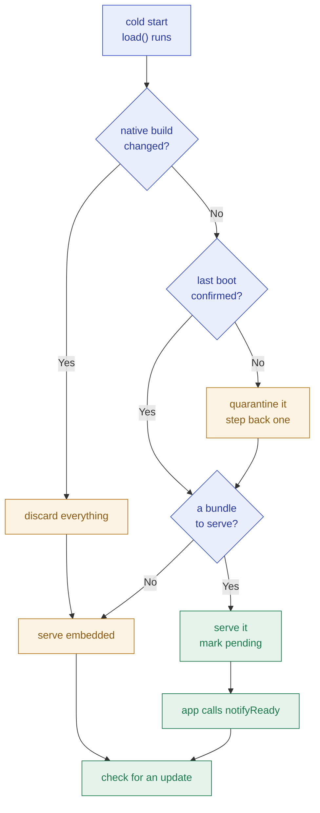

# The Overair Capacitor plugin

> **Native owns the device; TypeScript owns the protocol.** Everything that has
> to survive a web bundle which cannot execute - the boot decision, the
> rollback, the identity this binary subscribes to - runs in Kotlin and Swift
> before any JavaScript does. Asking `/v1/check` is ordinary HTTP and stays in
> TypeScript.

Design and decision record. Written before the code, corrected where building
and shipping it proved the design wrong - each correction marked, because a
design doc that quietly disagrees with the code is worse than none.

---

## 1 · How this got here

The first design was a **pure TypeScript library, no native code**, and the
reasoning was measured rather than assumed. Everything an OTA updater needs is
already native inside Capacitor:

| The SDK must | Provided by | Where |
|---|---|---|
| Download a bundle | `Filesystem.downloadFile` | `@capacitor/filesystem` `definitions.d.ts:626` |
| Point the webview at it | `WebView.setServerBasePath` - a **core** plugin | `@capacitor/core` `core-plugins.d.ts:6` |
| Verify `sha256` | WebCrypto | webview builtin |
| **Unzip** | **nothing** | the only gap |

A spike measured that one gap against a real 292-file, 7.26 MB Capacitor build
on an iPhone 16 Pro simulator:

| Phase | Time |
|---|---:|
| fetch the archive | 4 ms |
| `sha256` verify | 3 ms |
| unzip (`fflate`) | 102 ms |
| base64-encode 292 entries | 43 ms |
| `Filesystem.writeFile` x292 | 237 ms - **0.81 ms/file** |
| **archive to disk** | **382 ms** |

That number stands and it is not why the design changed.

> [!IMPORTANT]
> **D1 was reversed.** The measurement settled *speed*, which was never the
> real question. The question was what happens to a bundle that cannot
> execute, and only native code can answer it: `load()` runs while the bridge
> is being built, **before the webview is told to load anything**. That is the
> single place a white-screening bundle can be rolled back - by the time any
> JavaScript could notice, the broken bundle is already what is running. A
> pure-TS design could only approximate this by never persisting a base path
> and paying a boot hop on every launch.

What the reversal cost, and it is real: consumers need `cap sync` and a native
build, the package is pinned to a Capacitor major, and **a bug in the updater
now needs a store release to fix**. That last one is a genuinely strange
property for the thing whose job is to avoid store releases, and it is the
price of being able to recover from a bundle that will not start.

---

## 2 · The boot decision  *(the decision table)*

`native` = the current build number · `stored` = the build recorded when the
bundles were unpacked · `pending` = the last launch served a bundle that never
called `notifyReady()`

| # | `stored == native` | on disk | `pending` | -> serves | -> and |
|:-:|---|---|:-:|---|---|
| 1 | n/a | nothing | n/a | embedded | check for an update |
| 2 | **no** | anything | n/a | embedded | **discard every bundle** - they were unpacked for a binary that is gone |
| 3 | yes | staged | no | **the staged bundle** | mark PENDING; it gets one launch to prove itself |
| 4 | yes | active | no | the active bundle | check for an update |
| 5 | yes | staged + active | **yes** | the **active** one | quarantine the staged bundle, report `FAILED` |
| 6 | yes | active + previous | **yes** | the **previous** one | quarantine the active bundle |
| 7 | yes | active only | **yes** | embedded | quarantine it; nothing left to fall back to |

Rows 2, 5, 6 and 7 are the ones that earn the table.

**The invariant across every row: a bundle that has already had its one launch
and did not confirm is never served again.** Asserted directly, over every
combination of facts, in both `BootDecisionTest.kt` and `BootDecisionTests.swift`.

> [!NOTE]
> **Row 6 was added after the first version.** A failed bundle originally sent
> the user all the way back to the build in their binary, losing every update
> they had ever taken. Stepping back one costs them the broken update instead.
> Embedded is the floor, not the first resort - which is why the store keeps a
> predecessor and `prune()` keeps its files. A fallback whose files were
> deleted is not a fallback.

<details open>
<summary>Diagram 1 — the boot path</summary>



</details>

---

## 3 · Identity comes from the binary

`channel` is what a binary subscribes to at build time, forever
(`releases/models.py:25`). It is read from the **native plugin config** in
`capacitor.config.ts`, along with `runtime`, `apiUrl` and `apiKey`.

If it lived in the web layer, a bundle mis-published to the wrong channel would
move every device that took it onto that channel **permanently** - no later,
correct publish on the old channel could ever reach them again, because they
are no longer asking for it.

> [!NOTE]
> **Corrected.** The pure-TS design captured these into Preferences on the
> first launch from the embedded bundle and refused to overwrite them. That
> worked, but it was a workaround for not having native config. Reading
> `capacitor.config.ts` natively is the same guarantee without the ceremony:
> the file is compiled into the binary and an update cannot rewrite it.

---

## 4 · Integration

```ts
// capacitor.config.ts - in the binary, not in app code
plugins: {
  Overair: {
    apiUrl: 'https://overair.example.com',
    apiKey: 'oa_client_...',    // a client key is public by design
    channel: 'production',
    runtime: 'fp_a91c4e2d1fb',  // this native build's fingerprint
  },
}
```

```ts
// main.ts - BEFORE the app bootstraps
await startOta();               // confirm this boot, then check
bootstrapApplication(AppComponent, appConfig);
```

> [!IMPORTANT]
> **Do not put the check behind the app's own initialisation.** An update is
> most needed exactly when the app cannot finish starting. Wired into a
> component, it never ran at all while the host app's initializer was hanging -
> the update mechanism sitting behind the thing it exists to repair.

> [!NOTE]
> **Corrected.** This section previously specified a separate `overair-boot.js`
> owning `index.html`'s entry point. Two things were wrong with it: the native
> `load()` already decides before the webview loads, so nothing in the web
> layer needs to run first; and a second script would have meant **two
> implementations of the boot decision**, exactly what `DELIVERY_MODEL.md` §8
> S4 rules out for the rule matcher.

**Confirmation must precede the check.** `notifyReady()` is what promotes a
staged bundle to current; a check that overtakes it reports the device as
running nothing, and the server dutifully offers back the bundle it is already
running.

---

## 5 · The update lifecycle

| State | Meaning |
|---|---|
| `DOWNLOADING` | streaming to disk, hashing as it goes |
| `VERIFYING` | digest checked before a single file is written |
| `UNPACKING` | expanding; entries that escape the directory are refused |
| `READY` | on disk and verified |
| `FAILED` | with a `code` and whether a retry is worth offering |
| `CANCELLED` | somebody stopped it |

Verifying and unpacking are separate states because they are separately slow
and separately able to fail: a digest mismatch and a corrupt archive are
different problems, and only one of them is worth retrying.

From `READY` there are two ways in:

- **Next launch** - the default. Nothing is interrupted.
- **`applyNow()`** - reloads the webview into the new bundle immediately.

**The reload is the restart.** An iOS app cannot relaunch itself: `exit()`
reads as a crash and is rejected in review, and killing the process drops the
user on a home screen with no explanation. A reload replaces the entire web
layer, which is the part an OTA update replaces anyway. `applyNow()` sets
`pending` exactly as a launch-time swap does, so a bundle that breaks this way
is caught by the same watchdog and needs no separate path.

**Retry re-checks; it does not replay.** Download URLs are presigned and
short-lived. Replaying the attempt that failed re-uses a link that may have
expired - a button that cannot work however many times it is pressed.
`retryable` is still honoured: a digest mismatch means the bytes on the server
are wrong, and a fresh link fetches the same wrong bytes.

---

## 6 · Force update

`mandatory` is set by the **server**, on the release. A client that could
decide this for itself would be a client that can lock out its own user.

When set, the host app is expected to block: no dismiss, nothing else
reachable, one action. The SDK also ignores `auto_max_bytes` for a mandatory
release - a build that is actively broken is worth the megabytes.

---

## 7 · Cases matrix — input / state -> expected outcome

| Input / state | Expected outcome |
|---|---|
| First ever launch | `install_id` generated once, never regenerated |
| Check returns `update: null` | nothing downloaded, `reason` recorded |
| Digest mismatch | discarded, `FAILED` with code `digest`, **not** retryable |
| HTTP or network failure | `FAILED`, retryable, retry performs a fresh check |
| Size over `auto_max_bytes`, not mandatory | not downloaded; reported as deferred |
| Size over `auto_max_bytes`, mandatory | downloaded anyway |
| Bundle already staged, offered again | **not** re-downloaded |
| Staged bundle confirms | becomes current, predecessor retained |
| Staged bundle never confirms | quarantined; previous serves; `FAILED` reported |
| A quarantined bundle is offered again | sent in `quarantined`; server answers `HELD_QUARANTINE` |
| Native build changed | every bundle discarded, embedded serves |
| `applyNow()` with nothing staged | rejects |
| `rollback()` with no predecessor | lands on embedded |
| Archive entry containing `..` or a symlink | refused before anything is written |
| Airplane mode | check fails silently, app runs on what it has |

---

## 8 · Decisions — signed off

| # | Decision | Ruling |
|:-:|---|---|
| **D1** | ~~Pure TS library~~ Native plugin? | **REVERSED to native.** Speed was never the question; recovering a bundle that will not execute was, and only `load()` can. Cost: `cap sync`, a Capacitor major pin, and a store release to fix the updater itself. |
| **D2** | Call `persistServerBasePath`? | **No.** The plugin decides on every launch in `load()`. Persisting would let Capacitor restore a path the decision has not seen. |
| **D3** | Where do `channel` and `runtime` live? | **Native plugin config.** In the web layer they are editable by the very thing they constrain. |
| **D4** | Timer watchdog, or next-launch? | **Next launch.** The failure defended against is "no JavaScript ran at all", and a timer is JavaScript. |
| **D5** | Fall back to embedded, or to the predecessor? | **The predecessor.** Embedded is the floor. A broken bundle should cost one update, not all of them. |
| **D6** | Kill the process to apply, or reload the webview? | **Reload.** iOS cannot relaunch itself, and the web layer is the whole of what an update replaces. |
| **D7** | Retry by replaying, or by re-checking? | **Re-check.** A presigned URL that failed may simply have expired. |
| **D8** | Who decides an update is mandatory? | **The server.** A client that could decide it could lock out its own user. |
| **D9** | Deltas in v1? | **No.** The full `url` is always offered beside a delta, so this defers at no cost to correctness. |
| **D10** | Publish to npm? | **Not yet - a git dependency.** `dist/` is committed, because npm does not reliably run `prepare` for one. |

---

## 9 · What integrating it into a real app found

Every one of these passed unit tests, compiled, and was wrong. They are
recorded because the pattern is the point: **the bugs were all in the seam
between the plugin and its host**, which is the one place a unit test cannot
reach.

| Found | Why no test would have caught it |
|---|---|
| `setServerBasePath("")` served a blank page | The boot *decision* was right; what the plugin did with it was not. The app was dead on first launch. |
| Installed with no JavaScript in it | `dist/` was gitignored and npm did not run `prepare` for the git dependency. |
| Re-downloaded a bundle already on disk | The server keeps offering until the device reports it as current, which only happens after `notifyReady`. |
| `retry()` replayed a dead presigned URL | The object was restored on the server and the button still failed, forever. |
| **iOS `setServerBasePath` does not reload the webview** | Android's posts its own `loadUrl`; the iOS one only repoints the asset handler (`CapacitorBridge.swift:176`). Every launch-time swap hid it, because `load()` runs before the webview loads anything. |
| Plugin methods run off the main queue | A webview touched from the background queue does nothing and says nothing. |
| State still read `READY` after applying | A webview reload does not restart the process, so the native side outlives the web layer. |
| The check overtook the confirmation | The device reported itself as running nothing and was re-offered what it was running. |

---

## 10 · Open points

- **Android is unverified end to end.** It compiles and its unit tests pass,
  but no Android device has taken an update. The emulator would not authorise
  over adb during testing.
- **No resume.** A cancelled or dropped download restarts from zero. iOS gives
  resume data for free via `cancel(byProducingResumeData:)`; Android would need
  a `Range` header. Worth doing before large bundles ship over patchy links.
- **A bundle that confirms and only then crashes is not caught.** The watchdog
  proves the app reached first render, not that it works. `rollback()` exists
  for the app to call when it knows better; nothing detects it automatically.
- **Deltas.** The server builds them; this ignores them and takes the full
  bundle.
- **`tree_sha256` is stored but unused.** It is what a delta would be verified
  against. Keeping it from day one costs a field; retrofitting it means every
  device that updated before deltas shipped cannot use one until it takes a
  full bundle.

---

<sub>overair-capacitor. Verified: 10 Swift, 10 Kotlin and 6 TypeScript tests; an end-to-end update applied on an iPhone 16 Pro simulator against a live server.</sub>
